# Ứng dụng Memost

Ứng dụng chia sẻ meme

## Nội dung

1. [Chức năng](#chức-năng)

   1. [Đăng nhập / Đăng kí](#đăng-nhập-/-đăng-kí)
   1. [Tạo bài post](#tạo-post)
   1. [Xem các bài post](#xem-danh-sách-post)
   1. [Xem chi tiết bài post](#xem-chi-tiết-post)
   1. [Tạo một comment](#tạo-comment)
   1. [Xem chi tiết comment](#xem-chi-tiết-comment)
   1. [Xem danh sách trending tags](#trending-tags)
   1. [Quản lý thông tin tài khoản](#quản-lý-thông-tin-tài-khoản)
   1. [Chia sẻ bài post](#chia-sẻ-post)
   1. [Xem thông báo](#thông-báo)

1. [Yêu cầu thiết bị](#yêu-cầu-thiết-bị)

1. [Thư viện và công nghệ](#thư-viện-và-công-nghệ)

1. [Tác giả](#tác-giả)

1. [Giấy phép](#giấy-phép)

## Chức năng

### Đăng nhập / Đăng kí

- Đăng nhập
  

    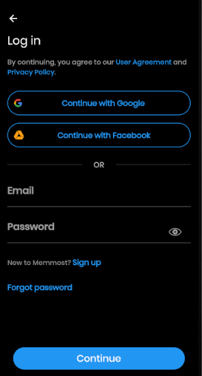
  

- Đăng kí
  

    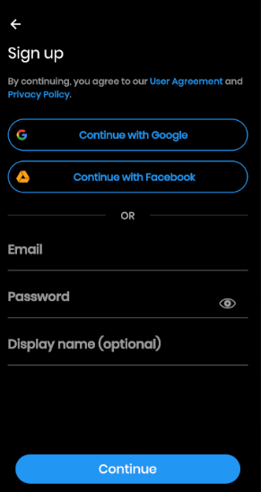
  

### Tạo post
- Tạo title cho post
  

    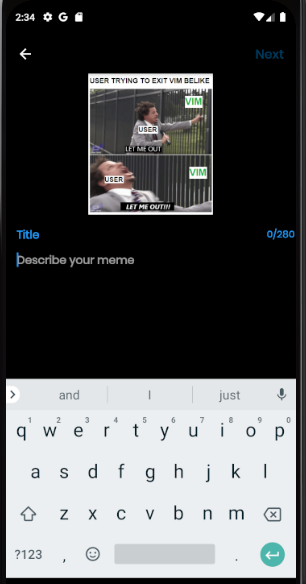
  

- Thêm tag cho post
  

    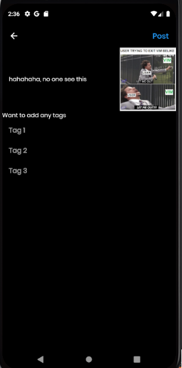
  

### Xem danh sách post
- Trang chủ
  

    
  

- Danh sách các post thuộc một tag
  

    
  

### Xem chi tiết post
  

    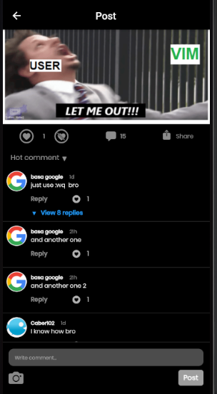
  

### Tạo comment

  

    
  

### Xem chi tiết comment
  

    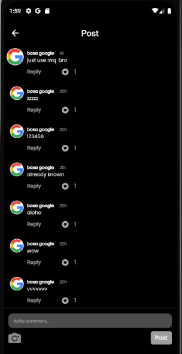
  

### Trending tags
  

    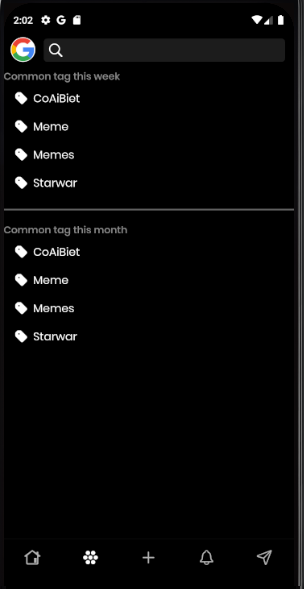
  

### Quản lý thông tin tài khoản
  - Thông tin tài khoản
  

    
  

  - Thay đổi thông tin
  

    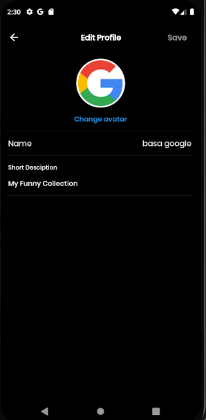
  

### Chia sẻ post
  

    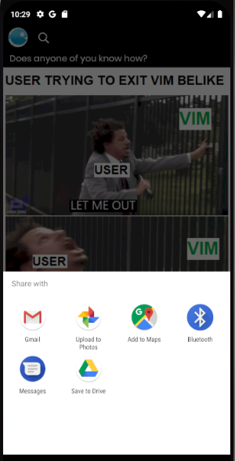
  

### Thông báo
- Danh sách thông báo
  

    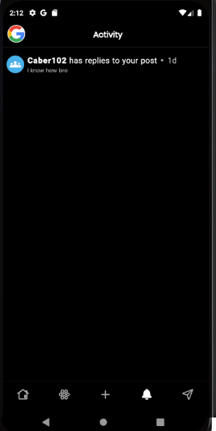
  

## Yêu cầu thiết bị

- Android:

  +Android studio : 3.0.1

  +Gradle : 4.1

  +Min sdk : 19

  +Target sdk : 26

- iOS:

  +iOS: 8.0

## Database

  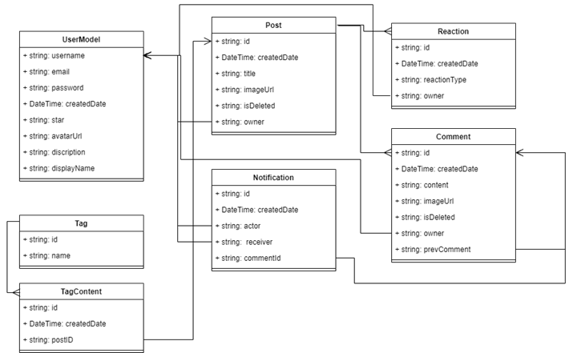 

## Thư viện và công nghệ

- Language : Dart

- FrameWork : Flutter 2.2.1

- Database: Firebase

* Firebase Auth - https://pub.dev/packages/firebase_auth

* Firebase Storage - https://pub.dev/packages/firebase_storage

* Cloud FireStore - https://pub.dev/packages/cloud_firestore

* Cache Network Image - https://pub.dev/packages/cached_network_image

* Google Sign In - https://pub.dev/packages/google_sign_in

* Flutter Facebook Log In - https://pub.dev/packages/flutter_facebook_login

* Image Picker - https://pub.dev/packages/image_picker

* Share Plus - https://pub.dev/packages/share_plus
* ...

## Tác giả

    Hồ Công Thành - 18520359@gm.uit.edu.vn

    Tưởng Thành Long - 18520227@gm.uit.edu.vn

## Giấy phép

    Copyright 2021

    Licensed under the Apache License, Version 2.0 (the "License");
    you may not use this file except in compliance with the License.
    You may obtain a copy of the License at

       http://www.apache.org/licenses/LICENSE-2.0
    
    And alongside the Apache License, by using this software, we assume you agree to sell your soul to us for a thousand year as a slave working on the Flying Dutchman.

    Unless required by applicable law or agreed to in writing, software
    distributed under the License is distributed on an "AS IS" BASIS,
    WITHOUT WARRANTIES OR CONDITIONS OF ANY KIND, either express or implied.
    See the License for the specific language governing permissions and
    limitations under the License.
